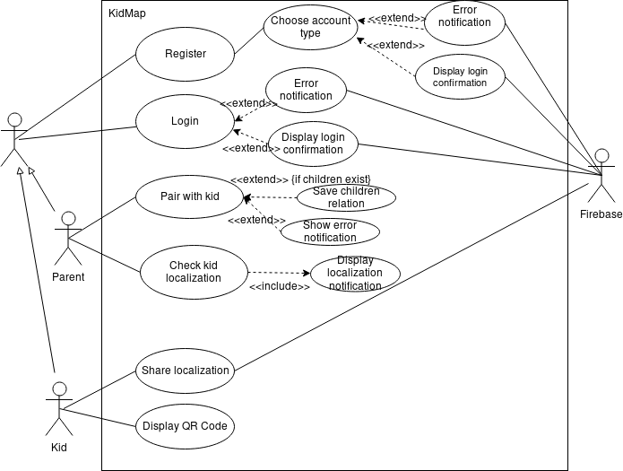

# KidMap

## Intro
Simple mobile app for localizing where is your kid!
Built with [React Native](https://facebook.github.io/react-native/).
_Our app is still under construction._

## About
We strongly believe that our kids are the most important things in our life.
It is very hard to always keep an eye on them.
They are full of energy and charisma.
To protect them, our team has developed great app to track them!

Nowadays, almost everyone has got a mobile phone and access to the Internet.
We use geolocalization technology to localize kids.
Our infrastructure is based on [Firebase](https://firebase.google.com/).
Maps functions are provided thanks to [Google Maps API](https://developers.google.com/maps/documentation/) help.
With this simple app you can track your kid position at any time.
It keeps you calm and your kid *safe*!

Our journey was not so short. We have overcome many tasks...

This is a screenshot of our Issue Board from [GitKraken GLO](https://www.gitkraken.com/glo)

## Mockup Design - Our first attempts and sketches

## Don't want to download app yet?

*Try our prototype!*

Our team struggled to create this amazing prototype to attract your attention!
It is based on beautifull and simple creator [Just In Mind](https://www.justinmind.com/)
Both are free.

### Click [*here*](https://github.com/akubala/KidMap/raw/master/mockup/kidmap-prototype.vp) to download!

---
## Use Case Diagram
We can also illustrate all functionalities using this diagram:

---

# Download section

## **App available!**

[DOWNLOAD](https://expo.io/artifacts/0c908a1a-b349-4b10-ae48-b834ab7e6d8c)

---

## Maintainers
* [Damian](https://github.com/damian199674)
* [Jakub](https://github.com/jaksak)
* [Piotr](https://github.com/PiotrDrozdz96)
* [Adrian](https://github.com/akubala)

### We hope that you will enjoy this app and it will help you to protect your kids!

---

## Additional Info
Icons made by [Freepik](https://www.freepik.com/)
from [Flaticon](https://www.flaticon.com/) are licensed by [Creative Commons BY 3.0](http://creativecommons.org/licenses/by/3.0/")
